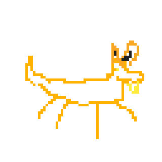
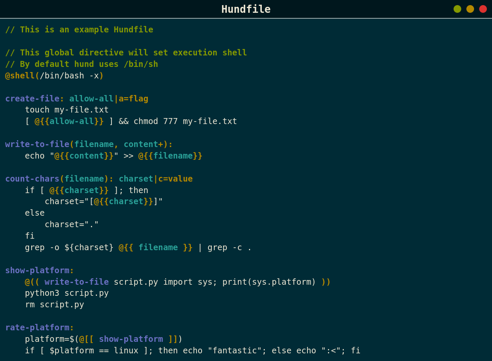
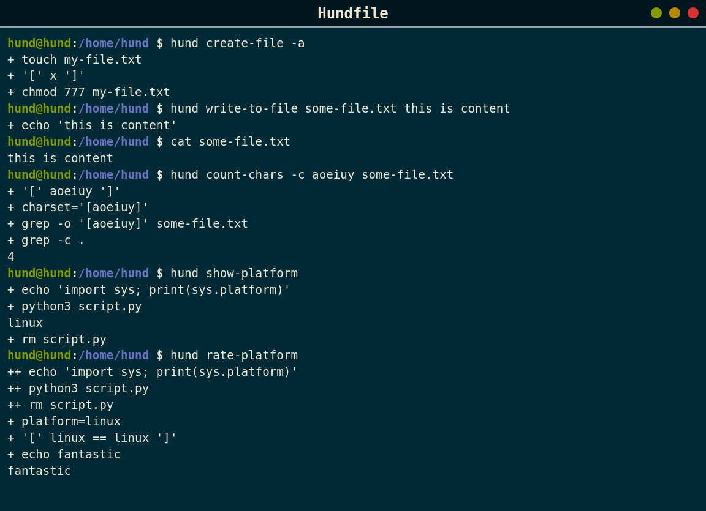
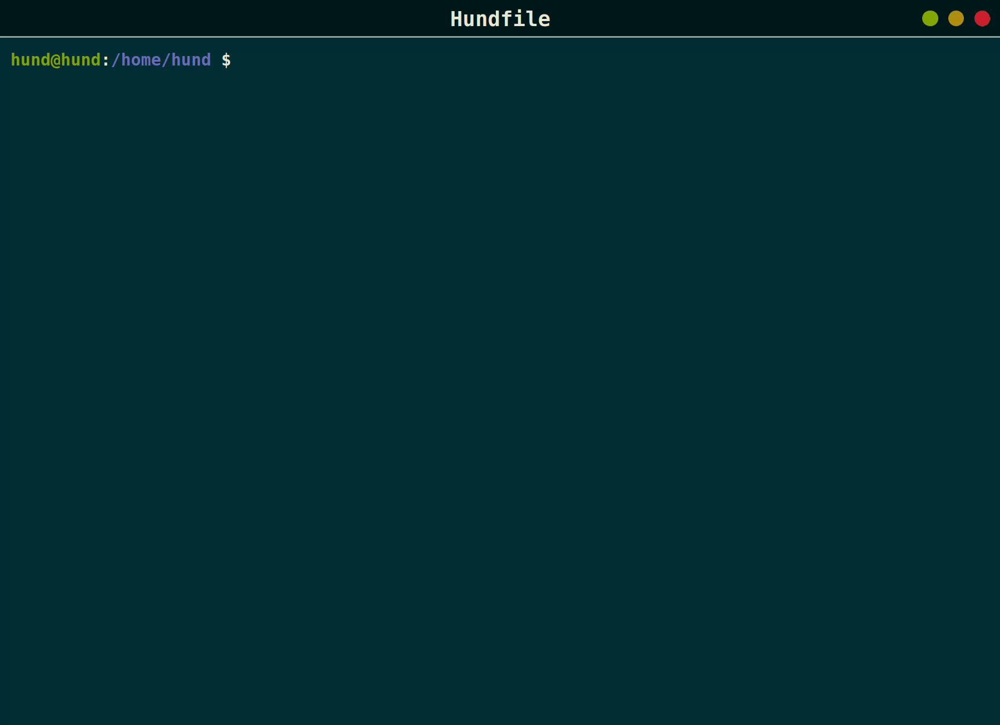
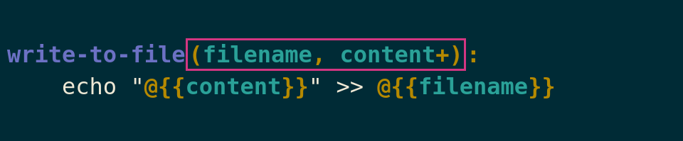
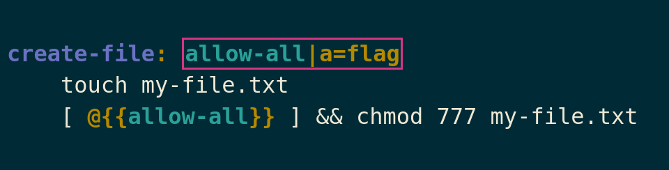
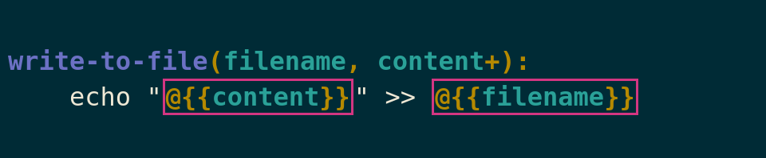
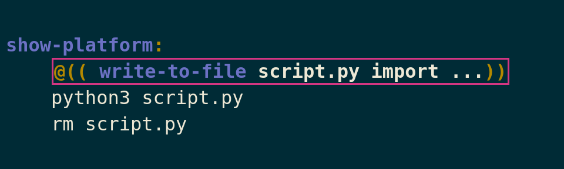
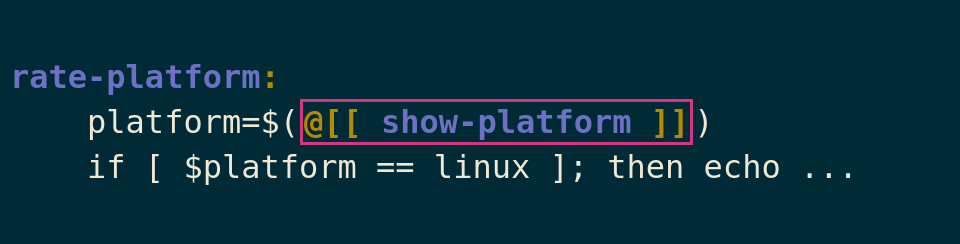

<div align="center">


<h1> hund </h1>


<h3>Create and run project-related scripts with ease. Hund is a task-runner meant to be a simple replacement for tools like <a href="https://www.gnu.org/software/make/">Make</a> or <a src="https://taskfile.dev/">Task</a>.</h3>

</div>

## Example
###### Terminal color palette can be found [here](https://ethanschoonover.com/solarized/)

<details>

<summary>Hundfile</summary>

```
// This is an example Hundfile

// This global directive will set execution shell
// By default hund uses /bin/sh
@shell(/bin/bash -x)

create-file: allow-all|a=flag
    touch my-file.txt
    [ @{{allow-all}} ] && chmod 777 my-file.txt

write-to-file(filename, content+):
    echo "@{{content}}" >> @{{filename}}

count-chars(filename): charset|c=value
    if [ @{{ charset }} ]; then
        charset="[@{{ charset }}]"
    else
        charset="."
    fi
    grep -o ${charset} @{{filename}} | grep -c .

show-platform:
    @(( write-to-file script.py import sys; print(sys.platform) ))
    python3 script.py
    rm script.py

rate-platform:
    platform=$(@[[ show-platform ]])
    if [ $platform == linux ]; then echo "fantastic"; else echo ":<"; fi
```

</details>




### Run:

<details>
<summary>Commands</summary>

```
hund create-file -a
```
```
hund write-to-file some-file.txt 
```
```
cat some-file.txt
```
```
hund count-chars -c aoeiuy some-file.txt
```
```
hund show-platform
```
```
hund rate-platform
```

</details>

<details>

<summary>Static</summary>



</details>




## Target Inputs
### Arguments



Arguments have to be defined in the paranthesis right after the target name and before the colon. When running a target, they should appear after any options you want to pass. There are 4 types of arguments: "single", "any", "at least one", "optional". Three of them ("any", "at least one" and "optional") can appear only on the last place of arguments list.

#### single
These are the basic type of arguments, they are required when calling the target and expect single value.
```
my-target(arg1, arg2):
    echo @{{arg1}} @{{arg2}}


$ hund my-target v1 v2
v1 v2

$ hund my-target
[ERROR][main.go:46] missing argment "arg1" (parser.go:275)
```

#### any
These arguments are defined by adding `*` to the argument name. They accept any count of values.
```
my-target(arg1, arg2*):
    echo @{{arg1}} @{{arg2}}

$ hund my-target v1 v2
v1 v2

$ hund my-target v1 v2 v3
v1 v2 v3

$ hund my-target v1
v1

```

#### at least one
These arguments are defined by adding `+` to the argument name. They accept one or more values.
```
my-target(arg1, arg2+):
    echo @{{arg1}} @{{arg2}}

$ hund my-target v1 v2
v1 v2

$ hund my-target v1 v2 v3
v1 v2 v3

kamil$ hund my-target v1
[ERROR][main.go:46] missing argument "arg2" (parser.go:290)
```

#### optional
These arguments are defined by adding `?` to the argument name. They accept at most one value.
```
my-target(arg1, arg2?):
    echo @{{arg1}} @{{arg2}}

$ hund my-target v1
v1

$ hund my-target v1 v2
v1 v2

$ hund my-target v1 v2 v3
[ERROR][main.go:46] too many arguments, "arg2" accepts at most 1 value (parser.go:286)
```

### Options



Options have to be defined after the colon in target definition. When calling a target, options have to appear before any arguments you want to pass to it. When declering an option you can choose if you want to supply the single-char alias. There are two types of options: flags and values.

#### flags
This type of option are simple true/false switches. By default when flag option appears in target call, the corresponding variable is set to 'x'. The value that is assigned to flag option can be changed by using `@flagValue` global directive.

```
my-target: a-flag|a=flag b-flag=flag
    echo a-flag=@{{a-flag}} b-flag=@{{b-flag}}

$ hund my-target
a-flag= b-flag=

$ hund my-target -a
a-flag=x b-flag=

$ hund my-target --b-flag
a-flag= b-flag=x

$ hund my-target --b-flag --a-flag
a-flag=x b-flag=x
```

#### values
This type of options expect a value. They work similar to flags but instead of having a value of x they get assigned whatever value was passed when calling a target.
```
my-target: foo|f=value bar=value
    echo foo=@{{foo}} bar=@{{bar}}

$ hund my-target
foo= bar=

$ hund my-target -f bazf
foo=bazf bar=

$ hund my-target --bar bazb
foo= bar=bazb

$ hund my-target --bar bazb --foo bazf
foo=bazf bar=bazb
```

## Dynamic Content

### Variables



Variables are defined by specifying arguments or options in target declaration. They can be used in script with following syntax `@{{ <varname> }}`.

```
my-target(argument): option|o=value
    echo argument=@{{argument}} option=@{{ option }}

$ hund my-target --option bar foo
argument=foo option=bar
```

### Calls



You can use a script defined in another target by calling it with following syntax `@(( <targetname> ))`. Passing options and arguments works the same as when calling that target directly via `hund` invocation.

This type of target invocation has a limitation. It need to be placed on it's own line. Called script is placed without any additional transformation.

```
my-target(argument): option|o=value
    echo argument=@{{argument}} option=@{{ option }}

my-other-target:
    echo running my other target
    @(( my-target -o bar foo ))

$ hund --dry-run my-other-target
echo running my other target
echo argument=foo option=bar
```

### Embeds



This one is similar to `Calls`. You can call another target with following syntax `@[[ <targetname>
]]`. Called script is put as single line exactly in place of `@[[ <targetname> ]]`. All newlines are replaced by character (or string) defined with `@embedSep` global directive. By default, the seperator is set to ';'.

```
my-system:
    echo "import sys; print(sys.platform)" > script.py
    python3 script.py
    rm script.py

hello:
    echo hello from $(@[[ my-system ]])

$ hund hello
hello from linux
```

## Global directives
### `@shell`
`@shell` sets the execution shell used by hund to run target scripts. It can point only to binary `@shell(/bin/bash)` or define additional options used when starting shell `@shell(/bin/bash -z -x) 

### `@embedSep`
Can be used to control how newlines are replaced when embedding one target into anther.

### `@flagValue`
Defines a value that is used to indicate true value for flag.
